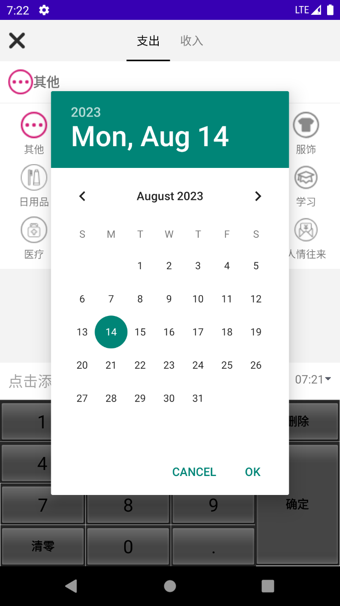
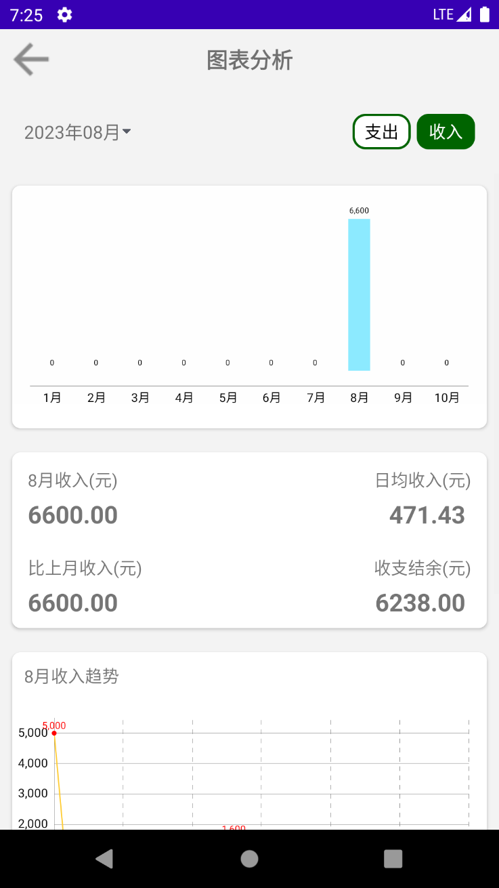

# BookKeeping

## 介绍

项目名称: 简约记账
项目描述：基于安卓基础知识点开发的个人记账工具，其中包括记录当天收支情况，计算当天以及当月共收支总钱数，能查看历史账单，能对于每月收支情况进行图标分析， 能够搜索用户关于某种记录的全部收支情况等功能。基本上能够解决个人记账的所有问题，界面简约美观，滑动流畅。

 项目重要技术点： 

1-绘制布局，掌握android基本view控件的属性和使用

 2-熟练掌握Activity页面展示，跳转和传值 

3-使用碎片加载界面，滑动视图或单选按钮切换页面 

4-自定义对话框 

5-自定义软键盘绘制和使用 

6-列表视图以及网格视图的适配器使用和页面加载 

7-使用Room框架，熟练创建表，并进行增删改查

 8-定义drawable文件，设定布局以及控件样式

 9-使用MPAndroidChart第三方框架绘制柱状图

## 页面展示

### 1. 主页面

### 2. 搜索页面

### 3. 记录页面

### 4. 设置页面

### 5. 关于页面

### 6. 分析页面

